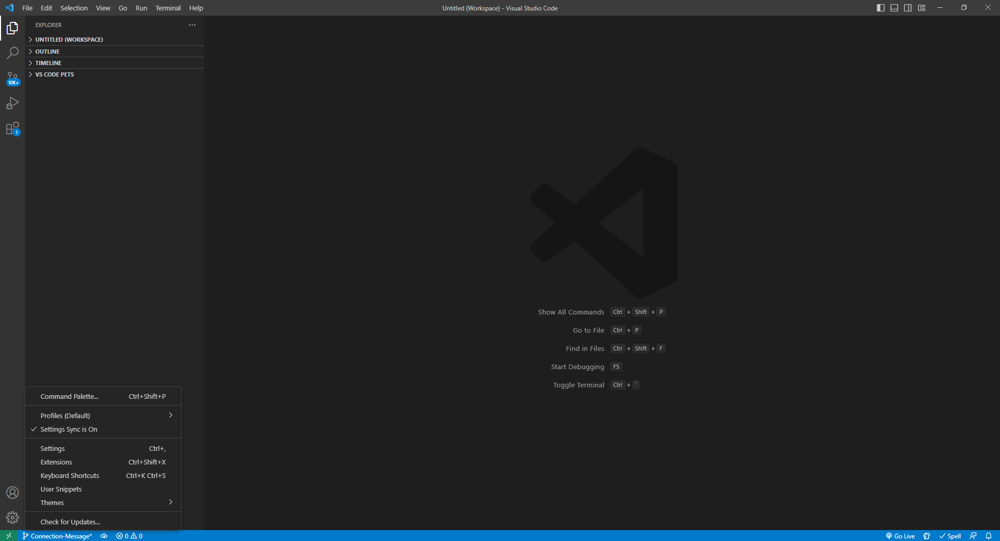
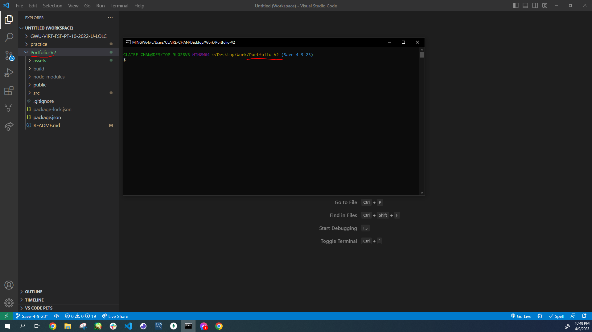
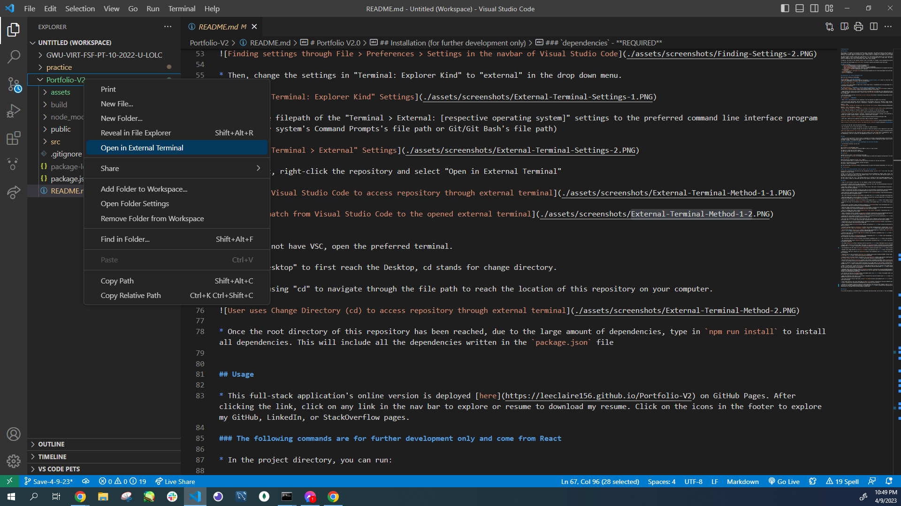
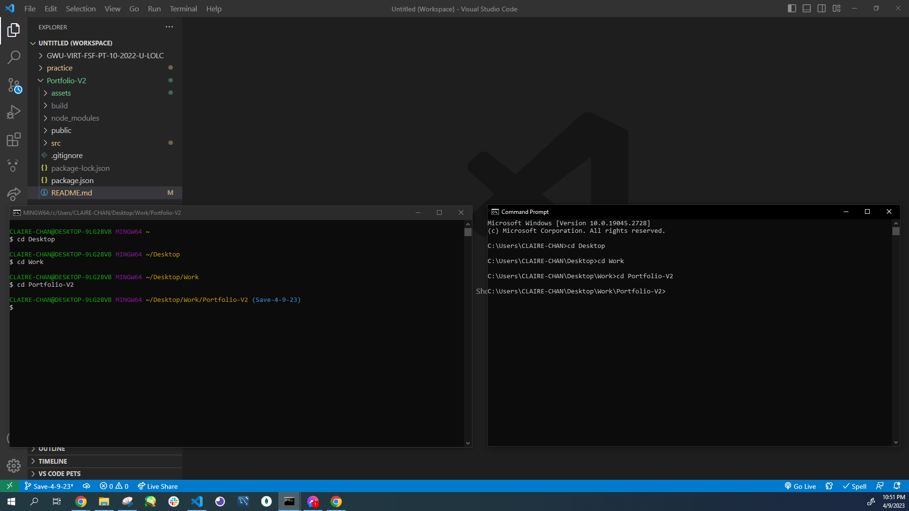

# Portfolio V2.0

## Description

This project is an update on my previous portfolio page, using React. This website features a header with a navigation bar containing the links to the About Me, Portfolio, and Contact pages of my portfolio page. A resume anchor is included in the navbar for users to download my resume.

The About Me page includes my photo and a description of me. The Portfolio page features six of my recent projects with their title, thumbnail images, a link to the GitHub repository, and 
a link to the deployed site or a demo video. The Contact page includes a form with built-in validations where users can add their name, email, and a message.

In addition, the footer of this website contains links to my GitHub, my LinkedIn, and my StackOverflow profile pages.

This project was bootstrapped with [Create React App](https://github.com/facebook/create-react-app).

## Table of Contents
- [Installation](#installation-for-further-development-only)
    - [Git/GitBash](#gitgitbash---strongly-recommended)
    - [Visual Studio Code](#visual-studio-code-vsc---strongly-recommended)
    - [Node (REQUIRED)](#node-version-16---required-to-download-node-based-dependencies-ie-mongoose-and-express)
    - [dependencies (REQUIRED)](#dependencies---required)
- [Usage](#usage)
    - [Commands (Further Development Only)](#the-following-commands-are-for-further-development-only-and-come-from-react)
- [Credits](#credits)
- [Questions](#questions)

## Installation (for further development only)

Make sure the following are downloaded:

### `Git/GitBash` - *Strongly Recommended*
* While this application can be run using with the default **command prompt**, it is easier to clone this repository by using Git/GitBash, which can be downloaded [here](https://git-scm.com/downloads).

### `Visual Studio Code [VSC]` - *Strongly Recommended*

* If you'd like to make changes to these files, Visual Studio Code is recommended and can be downloaded for free [here](https://code.visualstudio.com/download).

### `Node version 16` - **REQUIRED** to download node-based dependencies (i.e. react)
* Go to [Node's homepage, https://nodejs.org/en/](https://nodejs.org/en/), then [Downloads](https://nodejs.org/en/download/) and scroll down to the [Previous Releases](https://nodejs.org/en/download/releases/) bullet point. 

* Toggle between the results until the desired version 16 package and click Download. This application was developed with [Node.js version 16.18.0](https://nodejs.org/dist/v16.18.0/), click on [node-v16.18.0-x64.msi](https://nodejs.org/download/release/v16.18.0/node-v16.18.0-x64.msi) to download.

* The Full-Stack Blog also has [instructions on how to download Node](https://coding-boot-camp.github.io/full-stack/nodejs/how-to-install-nodejs).

### `dependencies` - **REQUIRED**

* These **MUST** be installed into this repository, start by opening the command line interface.

* If you have Visual Code Studio, add this repository to the workspace. Then, go to 'Settings' either through the cog icon in the lower left corner and clicking Settings, go to File -> Preferences -> Settings in the menu bar, or the key combo of Ctrl+,

Method 1 - Cog:

Method 2 - File > Preferences > Setting:

* Then, change the settings in "Terminal: Explorer Kind" to "external" in the drop down menu.

        
* Change the filepath of the "Terminal > External: [respective operating system]" settings to the preferred command line interface program (either your system's Command Prompts's file path or Git/Git Bash's file path)

* After that, right-click the repository and select "Open in External Terminal"

* If you do not have VSC, open the preferred terminal.

* Use "cd Desktop" to first reach the Desktop, cd stands for change directory.

* Continue using "cd" to navigate through the file path to reach the location of this repository on your computer.

* Once the root directory of this repository has been reached, due to the large amount of dependencies, type in `npm run install` to install all dependencies. This will include all the dependencies written in the `package.json` file

## Usage

* This full-stack application's online version is deployed [here](https://leeclaire156.github.io/Portfolio-V2) on GitHub Pages. After clicking the link, click on any link in the nav bar to explore or resume to download my resume. Click on the icons in the footer to explore my GitHub, LinkedIn, or StackedOverflow pages. 

### The following commands are for further development only and come from React

* In the project directory, you can run:

### `npm start`

Runs the app in the development mode.\
Open [http://localhost:3000](http://localhost:3000) to view it in your browser.

The page will reload when you make changes.\
You may also see any lint errors in the console.

### `npm test`

Launches the test runner in the interactive watch mode.\
See the section about [running tests](https://facebook.github.io/create-react-app/docs/running-tests) for more information.

### `npm run build`

Builds the app for production to the `build` folder.\
It correctly bundles React in production mode and optimizes the build for the best performance.

The build is minified and the filenames include the hashes.\
Your app is ready to be deployed!

See the section about [deployment](https://facebook.github.io/create-react-app/docs/deployment) for more information.

### `npm run eject`

**Note: this is a one-way operation. Once you `eject`, you can't go back!**

If you aren't satisfied with the build tool and configuration choices, you can `eject` at any time. This command will remove the single build dependency from your project.

Instead, it will copy all the configuration files and the transitive dependencies (webpack, Babel, ESLint, etc) right into your project so you have full control over them. All of the commands except `eject` will still work, but they will point to the copied scripts so you can tweak them. At this point you're on your own.

You don't have to ever use `eject`. The curated feature set is suitable for small and middle deployments, and you shouldn't feel obligated to use this feature. However we understand that this tool wouldn't be useful if you couldn't customize it when you are ready for it.

## Credits

* Credit to React for the commands in Usage (further development)

* Credit to initializing with React version 17.0.2 goes to [DanteDX](https://stackoverflow.com/users/12639918/dantedx) on StackOverflow:  https://stackoverflow.com/questions/71913692/module-not-found-error-cant-resolve-react-dom-client

* React bootstrap responsive navbar information provided by [React Bootstrap](https://react-bootstrap.github.io/):  https://react-bootstrap.github.io/components/navbar/

* DOC to PDF converter provided by [Adobe](https://www.adobe.com/):  https://www.adobe.com/acrobat/online/word-to-pdf.html

* Importing Google Fonts to CSS provided by [Tom](https://stackoverflow.com/users/158119/tom) on StackOverflow:  https://stackoverflow.com/questions/40769551/how-to-use-google-fonts-in-react-js

* Coming Soon font provided by [Google Fonts](https://fonts.google.com/):  https://fonts.google.com/specimen/Fredericka+the+Great

* Fredericka the Great font provided by [Google Fonts](https://fonts.google.com/):  https://fonts.google.com/specimen/Fredericka+the+Great

* Placing footer at bottom of page information provided by [freeCodeCamp](https://www.freecodecamp.org/):  https://www.freecodecamp.org/news/how-to-keep-your-footer-where-it-belongs-59c6aa05c59c/

* Importing images information provided by [Hawkeye Parker](https://stackoverflow.com/users/99717/hawkeye-parker) on StackedOverflow:  https://stackoverflow.com/questions/34582405/react-wont-load-local-images

* onBlur vs onChange react event listeners [Ruben Leija's blog Linguine Code](https://linguinecode.com/):  https://linguinecode.com/post/onblur-vs-onchange-react-text-inputs

* onBlur information further provided by [pope_maverick](https://stackoverflow.com/users/3065781/pope-maverick) on Stacked Overflow:  https://stackoverflow.com/questions/71838444/show-validation-after-click-outside-the-input

* Disabling text area property provided by [Donut](https://stackoverflow.com/users/121493/donut):  https://stackoverflow.com/questions/5235142/how-do-i-disable-the-resizable-property-of-a-textarea

* Text area rows information from How to Use a Multiline Text Area in ReactJS written by Gaurav Singhal on [Plural Sight](https://www.pluralsight.com/):  https://www.pluralsight.com/guides/how-to-use-multiline-text-area-in-reactjs

* Creating Bold Text with CSS font-weight property information provided by [W3Schools](https://www.w3schools.com/default.asp):  https://www.w3schools.com/cssref/pr_font_weight.php

* Email Validation Regex by [learnetto](https://github.com/learnetto):  https://github.com/learnetto/react-form-validation-demo/blob/master/src/Form.js

* Validation messages based on [CodingComics's](https://www.youtube.com/@codingcomics) YouTube Video `Form Validation in React JS || Input Validation React JS || React Form Validation onSubmit || React`:  https://www.youtube.com/watch?v=rZpc7HkmF5Q

* Tape CSS Code based on [Coding Artist's](https://www.youtube.com/@CodingArtist) YouTube Video `Washi Tape Notes With Pure CSS | HTML, CSS Tutorial`:  https://www.youtube.com/watch?v=2mYIh8-zgFQ&t=34s

## Questions

If you have any questions, my GitHub profile is www.github.com/leeclaire156, and my email is lee.claire156@gmail.com.